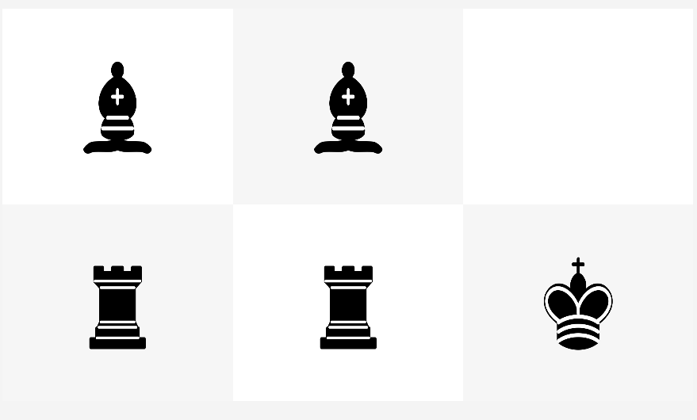

# Mini Chess Puzzle

This is a chess puzzle game implemented using JavaFX Scene Builder. The objective of the game is to rearrange the chess pieces on the game board to match a specific configuration.

## Game Description

The game board consists of 2 rows and 3 columns in which one king , two rooks and two bishop are placed. The initial arrangement of the chess pieces is as follows:

In each move, one of the chess pieces must be moved to the empty square. The chess pieces can move according to the rules of chess. The goal of the game is to obtain the following board configuration:

The player needs to strategise and find the correct moves to solve the puzzle.

## Features

- User-friendly graphical interface implemented using JavaFX Scene Builder.
- Chess piece movement adheres to the rules of chess.
- High score table to track and display top 10 results.
- Ability to save and load game progress (optional).

## Game Data Storage

The game data is stored using a JSON file. Each game result includes the following information:

- Date and time when the game was started/finished.
- Player name.
- Number of moves made by the player during the game.
- Outcome (solved/given up).